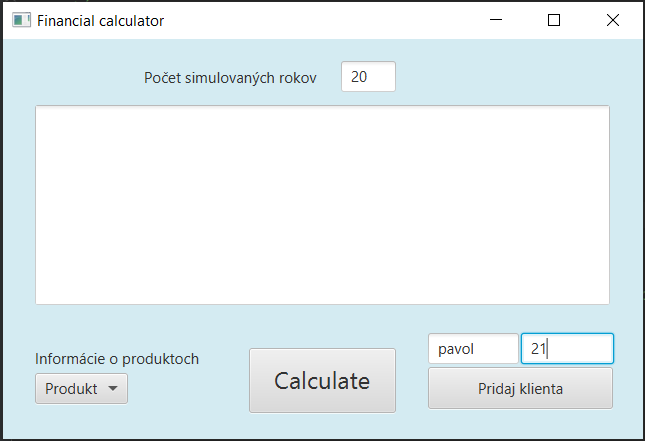
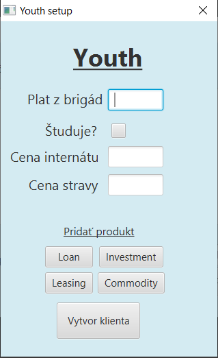
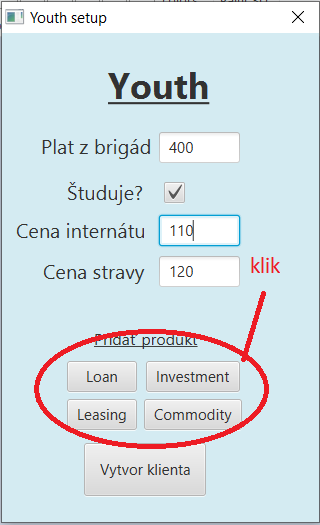
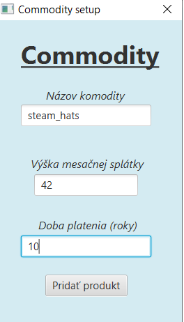
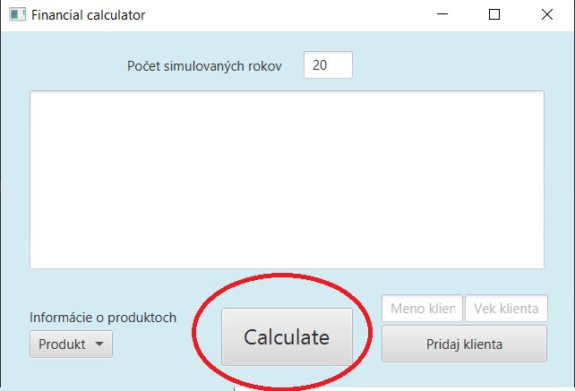

# Financna Kalkulacka - Pavol Krajkovic  103004

# Funkcionalita programu 

Program slúži na simuláciu vývoja finančnej bilancie klientov, ktorých zadáme. Najskor pridáme potencionálnych klientov, keď o nich nevieme 
ešte žiadne informácie. Vieme iba vek a meno. Následne ich inicializujeme (môžeme chápať, že dostaneme finančný súhlas na spracovanie citlivých 
informácií). Pridáme produkty, ktoré klienti majú. Zadáme koľko rokov by sme chceli simulovať a kalkulačka nám vypíše postupny priebeh ako sa 
vyvíjali ich financie v každom roku. Všetky produkty, ktoré majú naši klienti, sú rôzne a pracujú inak. Napríklad pri pridaní Leasingu klientovi sa najskôr platí akontácia,
tá sa však nemôže vyplatiť pokiaľ klient nemá dostatok financií. Keď bude mať, tak sa začne čerpať Leasing. 
**Môže sa stať, že človek bude v mínuse. Priklad, ja ako študent bývam na internáte a jem na internáte. Mesačne ma to stojí XYZ eur ale platia to rodičia (not for long tho), sumy v kalkulačke predstavujú vynosy/poplatky na tú osobu**

----
# Ako sa to spúšta
1. Zadáme počet simulovaných rokov do TextFieldu, ktorý sa nachádza hore v GUI.
2. Vpíšeme meno klienta a jeho vek, stlačíme tlačidlo na vytvorenie nového klienta.
2. Zobrazí sa nám nové okno, kde vpisujeme údaje o klientovi a pridávame mu nové produkty
3. Aby sme pridali nový produkt, tak klikneme na tlačidlo v okne klienta, ktoré predstavuje nami chcený pridaný produkt
4. Ak sme s klientom spokojný a má všetky produkty, ktoré potrebujeme, klikneme na vytvorenie klienta
**klientov môžeme pridávať donekonečna**
5. stlačíme v hlavnom okne tlačidlo **Calculate**   

**ak si nie sme istý ako funguje nejaký produkt, v hlavnom okne si ho môžeme vybrať z dropdown menu, kde sa dozvieme viacej informácií**

## Running code

# Popis tried

**MainController** - ovláda hlavné okno GUI, ktoré predstavuje kalkulačku, nachádzajú sa v ňom tri sekcie
   1. info o produktoch (dropdown menu)
   2. pridanie kliena
   3. simulácia rokov s delayom
   
**PersonController** - zjednotený ovládač pre okná generované pre vstupné informácie pre ludí, handluje nového klienta, ktorý boll
passnutý cez MainController.

**ProductController** - zjednotený ovládač pre okná generované pre vstupné informácie pre produkty, handluje nové produkty pre toho istého klienta, ktorý bol vytvorený v MainController a passnuty do personController na inicializáciu. Vytvorí nový produkt pre klienta a 
rovno ho aj inicializuje
   
**AudioThread** - classa ktorá extenduje Thread a zariaduje mi klikací zvuk v GUI, keď stlačím tlačidlo

**Calculator** - classa, ktorá bola mainom v pracovnej verzíí. Teraz má za úlohu inicializovať klientov a simulovať jeden rok pre všetkých klientov

**CalculatorGUI** - štart aplikácie, načíta mi hlavný FXML súbor, ktorý je ďalej ovládaný MainControllerom.

**Person** - abstraktná trieda, ktorá mi predstavuje človeka. V konštruktore má za úlohu novej inštancií triedy (ktorá extenduje z **Person**) priradiť meno, vek a nové portfólio produktov. Stará sa o pridanie produktu do portfolia a simuláciu jedneho roka pre danú osobu. 

**Adult** - trieda, ktorá extenduje z Person. Predstavuje mi dospelého človeka, ktorý neštuduje a má XYZ detí. Jedinú špeciálnu výhodu oproti iným triedam sú peniaze za deti.

**Youth** - trieda, ktorá extenduje z Person. Predstavuje mi mladého človeka, ktorý študuje. Otázka v inpute či studuje je mierená na vysokú školu. Ak chodí na vysokú školu, tak sa mu menia výdavky aj z ceny internátu a z ceny jedla na internáte. Ak zarába do 400 eur, neplatí daň z príjmu.

**Old** - trieda, ktorá extenduje z Person. Predstavuje mi starého človeka, ktorý už je na penzí. Automaticky sa vypočíta dôchodok podľa počtu odpracovaných rokov. Ak študoval v mladosti tak o toľko menej bude mať dôchodca dôchodok. Jeho výdavky predstavujú polovička príjmu z penzie + 20 eura na každé dieťa ktoré ma.

**HumanFactory** - factory design pattern, vráti mi novú person triedu na základe vloženého roku

**ProductFactory** - factory design pattern, vráti mi nový produkt na základe vloženého stringu

**Account** - najvyššia classa pre všetky triedy v produktoch. Každý produkt sa dá chápať ako jednoduchý účet v banke, na ktorý vkladáme peniaze

**Loan** - trieda, ktorá extenduje z Account. Trieda predstavuje pôžičku s jednoducým úročením. Úrok sa vypočíta z celkovej požičanej sumy a ďalej sa už nezvyšuje

**Leasing** - trieda, ktorá extenduje z Account. Trieda predstavuje leasing, kde aby sme mohli ho čerpať potrebujeme vstupnú akontáciu.
Vlastník leasingu nezačne platiť leasing dokým nebude mať peniaze na vstupnú akontáciu.

**Investment** - trieda, ktorá extenduje z Account. Trieda predstavuje Investovanie so zaručením ziskom. Trieda predstavuje zložené úrokovanie, takže úroky sa počítajú každý rok.

**Commodity** - trieda, ktorá extenduje z Investment. Trieda predstavuje Investovanie do komodít s nezaručením ziskom. Trieda predstavuje zložené úrokovanie, takže úroky sa počítajú každý rok. Ročný percentuálny výnos sa pomocou random metódy počíta každý rok. Môžeme si to predstaviť ako obchodovanie na burze.

**ProductI** - interface. V budúcnosti sa môže stať, že pridám do programu viacej produktov, ktoré nebudú pracovať na báze Account ako som spomínal vyššie. Napríklad to bude nejaké poistenie. Aby nám kalkulačka pracovala správne, tento novo pridaný produkt musí implementovať toto rozhranie.

**ProductOutput** - trieda ktorá slúži na vytvorenie správy o stave produktu

**ProductOperation** - vnorená trieda ktorá mi zaručí výpis špecialnych správ, napr ked Leasing môžeme začať čerpať tak sa vypíše, že bol pridaný nový leasing

**InvestmentOutput** - vnorená trieda, ktorá mi zaručí výpis špeciálnej správy, keď nám končí investovanie

# Splnenie hlavných požiadavok

## Adekvatne pouzitie dedenia
Program v sebe má dve nezávislé hierarchické štruktúry. Prvá je v package People, kde mám abstraktnú classu *Person* (neviem ju inicializovat)
a extenduju ju triedy *old*,*adult*,*youth*. Druha je v package products kde mám classu *Account*, ktorá predstavuje bežný účet a extendujú ju
triedy *Investment*, *Leasing*, *Loan*. Keďže všetky z nich sú nejakou formou účtu. *Commodity* ďalej extenduje *Investment*

## Prekonávanie vlastných metód ##
V programe je veľa prekonávaní metód a preto vypíšem iba jeden príklad
každá trieda podtypu Person prekonáva setUp, kde sa inicializuje človek
https://github.com/OOP-FIIT/oop-2020-uto-18-c-kovacik-pavol6999/blob/f2c492e62e24d49dc2adb56e0dfc06a60466c33b/src/Model/People/Youth.java#L53-L67

## Zapuzdrenie
Objekty majú atribúty private, (v prípade abstrat class protected) a pristupujeme k nim pomocou setterov a getterov

## Polymorfizmus
Polymorfizmus napríklad uplatňujem v triede calculator, kde pre všetkých klientov, ktorých dostanem ako parameter z mainController a volám metódu setUp() a počas behu programu sa rozhodne, v ktorej 
sa triede zavolám setup() 
https://github.com/OOP-FIIT/oop-2020-uto-18-c-kovacik-pavol6999/blob/f2c492e62e24d49dc2adb56e0dfc06a60466c33b/src/Model/Main/Calculator.java#L12-L17

## Agregacia
Všetky triedy, ktoré dedia z triedy Person majú svoj vlastny ArrayList portfolio, čo predstavuje ich produktové portfolio. V nom sú 
referencie na produkty v baliku Model.Products. Agregácia sa nachádza v programe aj na viacerých miestach ale použijem iba jeden príklad
https://github.com/OOP-FIIT/oop-2020-uto-18-c-kovacik-pavol6999/blob/f2c492e62e24d49dc2adb56e0dfc06a60466c33b/src/Model/People/Person.java#L19

## Oddelenie aplikačnej logiky od použivatelskeho rozhrania
Triedy nerobia viac vecí naraz, vstup aj výstup pre produkty a pre ludí mam oddelený, použítý MVC pattern pre gui

# Splnenie vedlajších požiadavok

## Navrhove vzory
V projekte som dvakrát pouzil navrhový vzor Factory, ktorý spadá pod typ Creational. Pomáha mi vytvárať klientov po zadaní ich veku a 
produkty po zadani ich nazvu. Pri vytváraní aplikácie a grafického rozhrania som použil MVC pattern. 

## Ošetrenie mimoriadnych stavov - výnimky
Neurobil som vlastnú výnimku ale catchoval som tie, ktoré sa nám môžu vyskytnúť v programe. Ak sa nahodou stane, že niekto vymaže nejaký FXML súbor vo View package, tak sa nám zobrazí AlertBox, ktorý nám povie že lokácia FXML súboru je neplatná. Druhý typ chytania podmienok je keď si v hlavnom okne nezadáme počet rokov pre simulované roky (alebo roky klienta), tak nám vypíše AlertBox, že je nespráne čislo v okienku.
https://github.com/OOP-FIIT/oop-2020-uto-18-c-kovacik-pavol6999/blob/f2c492e62e24d49dc2adb56e0dfc06a60466c33b/src/Controller/MainController.java#L132-L136

## Explicitné použitie viacnitovosti
V kóde sa mi to nachádza dvakrát, prvá je vlastná classa **AudioThread**, ktorá beží na vlastnom jadre a zaručuje mi zvuk pri kliknutí tlačidla. A druhá, ktorá je trošku lepšie premyslená je v **mainController**, ktorá mi zaručuje oneskorený výstup v hlavnom okne
https://github.com/OOP-FIIT/oop-2020-uto-18-c-kovacik-pavol6999/blob/f2c492e62e24d49dc2adb56e0dfc06a60466c33b/src/Controller/MainController.java#L97-L119

## GUI
Pre svoj program som vytvoril grafické prostredie. Dokopy 12 okien do ktorých sa vie user dostať. Grafické prostredie bolo tvorené s ideou MVC patternu. Ako ActionEvent handler tam mám napriklád, keď stlačím tlačidlo, tak zistím ktoré tlačidlo to stlačilo a na základe toho vytvorím nový produkt 
https://github.com/OOP-FIIT/oop-2020-uto-18-c-kovacik-pavol6999/blob/f2c492e62e24d49dc2adb56e0dfc06a60466c33b/src/Controller/PersonController.java#L85-L92

## Explicitné použitie RTTI
rozhodol som sa použiť RTTI v controlleroch a polymorfizmus v modeli. Ked dostanem do metódy **handleClient** v **personController** ako parameter novovytvorného klienta, tak zistím o akú inštanciu sa jedná a na základe toho vytvorím respektívne okno pre ten typ triedy
https://github.com/OOP-FIIT/oop-2020-uto-18-c-kovacik-pavol6999/blob/f2c492e62e24d49dc2adb56e0dfc06a60466c33b/src/Controller/PersonController.java#L63-L78

## Použitie vhniezdených tried a rozhraní
V programe sa mi nachdádza jedno rozhranie **ProductI**, ktoré je viac rozobraté vyššie a dve vnorené triedy v **ProductOutput**, ktoré mi vypisujú špeciálne správy ak produkt zanikol alebo sa vytvoril
https://github.com/OOP-FIIT/oop-2020-uto-18-c-kovacik-pavol6999/blob/f2c492e62e24d49dc2adb56e0dfc06a60466c33b/src/Model/Products/ProductOutput.java#L68-L84

## Lambda výrazy
Vďaka lambda výrazom a novému Threadu som zaručil aby sa updatoval výpis v hlavnom okne s oneskorením. 
https://github.com/OOP-FIIT/oop-2020-uto-18-c-kovacik-pavol6999/blob/f2c492e62e24d49dc2adb56e0dfc06a60466c33b/src/Controller/MainController.java#L97-L114

## Default method implementation 
dve metódy sú označené ako defaultné v **ProductI**, jedna mi zaručuje výpis a druhá zistí či je produkt vymazatelný. Pre každý produkt, ktorý sa pridá a implementuje toto rozhranie **ProductI** sa automaticky prenášajú tieto metodý na ne. 
https://github.com/OOP-FIIT/oop-2020-uto-18-c-kovacik-pavol6999/blob/f2c492e62e24d49dc2adb56e0dfc06a60466c33b/src/Model/Products/ProductI.java#L29-L38

## UML diagram
vytvoril som dva diagramy, jeden je vytvoreny ručne cez draw.io a druhy je vygenerovaný pomocou IntelliJ. V mojom vlastnom som sa snazil zamerat na tie hlavne veci

# OOP-projekt
